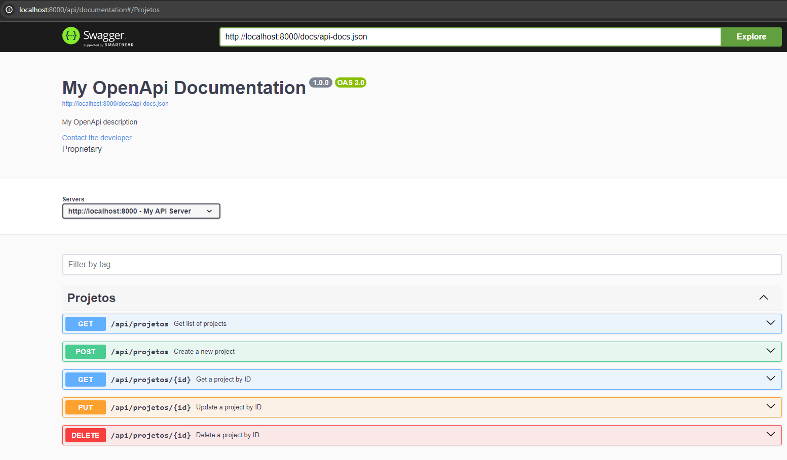

## Principais Ferramentas

- Laravel
- React
- Material ui
- Swagger

## Comandos para rodar o sistema

- composer install
- php artisan migrate --seed
- npm install
- npm run build | npm run dev

## se for executar o docker
- docker-compose up -d
``
http://localhost:8000
``

## Documentação API
``
url/api/documentation ex: http://localhost:8000/api/documentation
``

## Preview da API

